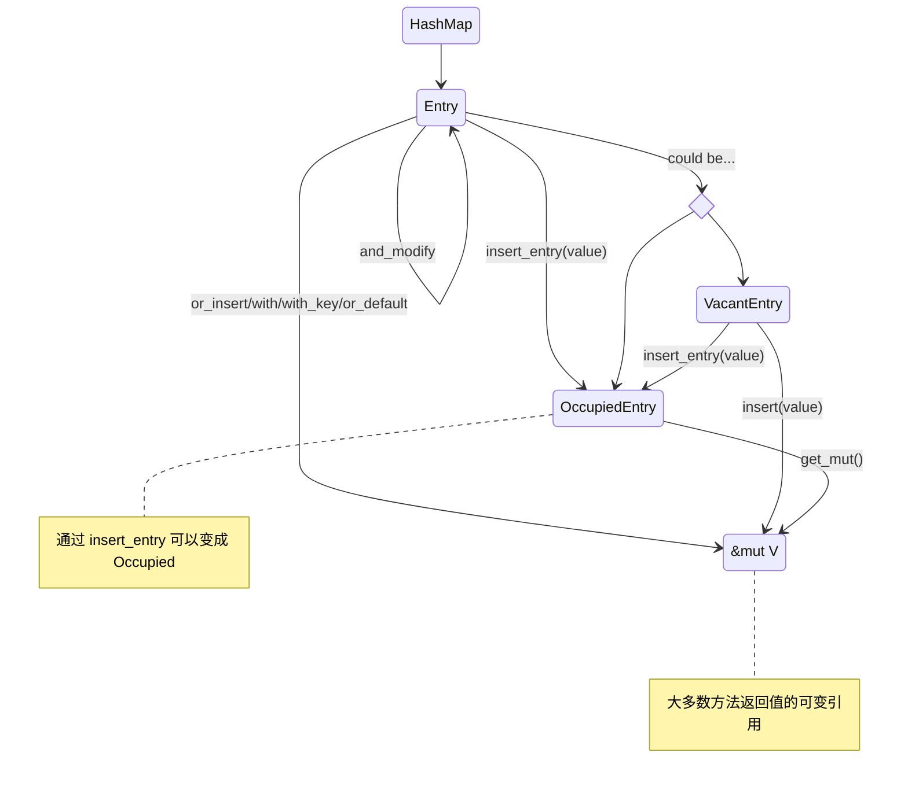

# 为什么 Rust 的 HashMap 这么难用啊？

## 前情提要

Rust 的 `HashMap` 在官方的样例里面里面是一个人畜无害的东西，甚至还因为有 `*map.entry().or_default() += 1` 这种很 rusty 的东西，让人觉得十分有魔力。


直到我在刷 leetcode 的时候没办法写出类似这样的 C++ 代码（不是 Rust 不行是我不行），我就知道事情远远没有这么简单...

```cpp
#include <unordered_map>

int main() {
    auto map = std::unordered_map<int32_t, int32_t>{};

    // init
    for (auto i : {1, 2, 3}) {
        map.emplace(i, i);
    }
    assert(map.size() == 3);

    // find key '1', reduce value by 1, delete if value is 0
    if (const auto it = map.find(1); it != map.end()) {
        it->second--;
        if (it->second == 0) {
            map.erase(it);
        }
    }
    assert(map.size() == 2);
}
```


好吧，那就来看看 `std::collections::HashMap` 吧。


## 回顾例子

可以先回顾一下简单的例子：

[在哈希 map 中存储键和关联值 - Rust 程序设计语言 中文版 (rustwiki.org)](https://rustwiki.org/zh-CN/book/ch08-03-hash-maps.html)

[散列表 HashMap - 通过例子学 Rust 中文版 (rustwiki.org)](https://rustwiki.org/zh-CN/rust-by-example/std/hash.html)


里面提到这些点，稍微记录一下：

1. 可以通过 `HashMap::new()` 或者 `zip` 迭代器然后 `collect` 创建一个 map；
2. `insert(K, V)` 是会移走所有权的；
3. `get(&K) -> Option<&V>`；
4. `Entry` 的 `or_insert() -> &mut V`；
5. `HashMap::iter() -> Iter<'a, K: 'a, V: 'a>` 且 `type Item = (&'a K, &'a V)`；

## 文档

[HashMap in std::collections::hash_map - Rust (rust-lang.org)](https://doc.rust-lang.org/std/collections/hash_map/struct.HashMap.html)

### 基础

```rust
pub struct HashMap<K, V, S = RandomState>
```

- 使用的哈希算法

  The default hashing algorithm is currently SipHash 1-3；

  The hashing algorithm can be replaced on a per-`HashMap` basis using the [`default`](https://doc.rust-lang.org/std/default/trait.Default.html#tymethod.default), [`with_hasher`](https://doc.rust-lang.org/std/collections/hash_map/struct.HashMap.html#method.with_hasher), and [`with_capacity_and_hasher`](https://doc.rust-lang.org/std/collections/hash_map/struct.HashMap.html#method.with_capacity_and_hasher) methods.

- Key 的 trait

  It is required that the keys implement the [`Eq`](https://doc.rust-lang.org/std/cmp/trait.Eq.html) and [`Hash`](https://doc.rust-lang.org/std/hash/trait.Hash.html) traits；

  可以使用：`#[derive(PartialEq, Eq, Hash)]`


### ✨实现的特化（重要）

折叠文档之后发现：

`HashMap` 的 methods （关联方法）是**分成了若干个 impl 块实现的，主要是对泛型参数的约束不同**。

所以也可以猜测到，实现中会依赖泛型参数中的什么 trait，比如说查找操作依赖 `K: Hash + Eq`，确实！


妙啊，太妙了！

我™️直接 CV 来看看，太有味了：

```rust
impl<K, V> HashMap<K, V, RandomState>

impl<K, V, S> HashMap<K, V, S>

impl<K, V, S> HashMap<K, V, S>
where
    K: Eq + Hash,
    S: BuildHasher,

impl<K, V, S> HashMap<K, V, S>
where
    S: BuildHasher,
```


### HashMap 的 Methods

#### 构造

`new()` 、`new_with_capacity()`：初始化一个 map， 附带初始容量。

`with_hasher()`、` with_capacity_and_hasher()`：可以指定 hasher。


#### 基本信息

`capacity()`、`len()`、`is_empty()`、`hasher()`


#### 访问型迭代器

| Method                 | Return Type           | Iterator                                                     |
| ---------------------- | --------------------- | ------------------------------------------------------------ |
| `keys(&self)`          | `Keys<'_, K, V>`      | `impl<'a, K, V> Iterator for Keys<'a, K, V>`<br />`type Item = &'a K` |
| `values(&self)`        | `Values<'_, K, V>`    | `impl<'a, K, V> Iterator for Values<'a, K, V>`<br />`type Item = &'a V` |
| `value_mut(&mut self)` | `ValuesMut<'_, K, V>` | `impl<'a, K, V> Iterator for ValuesMut<'a, K, V>`<br/>`type Item = &'a mut V` |
| `iter(&self)`          | `Iter<'_, K, V>`      | `impl<'a, K, V> Iterator for Iter<'a, K, V>`<br/>`type Item = (&'a K, &'a V)` |
| `iter_mut(&mut self)`  | `IterMut<'_, K, V>`   | `impl<'a, K, V> Iterator for IterMut<'a, K, V>`<br/>`type Item = (&'a K, &'a mut V)` |

注意到：无论使用哪种迭代器， **`K` 都是是不支持修改的**。


#### 消费型迭代器

| Method                                                       | Return Type                | Iterator                                                     |
| ------------------------------------------------------------ | -------------------------- | ------------------------------------------------------------ |
| `into_keys(self)`                                            | `IntoKeys<K, V>`           | `impl<K, V> Iterator for IntoKeys<K, V>`<br/>`type Item = K` |
| `into_values(self)`                                          | `IntoValues<K, V>`         | `impl<K, V> Iterator for IntoValues<K, V>`<br/>`type Item = V` |
| `drain(&mut self)`                                           | `Drain<'_, K, V>`          | `impl<'a, K, V> Iterator for Drain<'a, K, V>`<br/>`type Item = (K, V)` |
| `drain_filter<F>(&mut self, pred: F) -> DrainFilter<'_, K, V, F>`<br/>`where`<br/>    `F: FnMut(&K, &mut V) -> bool,` | `DrainFilter<'_, K, V, F>` | `impl<K, V, F> Iterator for DrainFilter<'_, K, V, F>`<br/>`where`<br/>    `F: FnMut(&K, &mut V) -> bool,`<br/>`type Item = (K, V)` |

上面几个迭代器，可以分别访问到 k、v 和 k-v，按需使用。

`drain`可以访问到值，遍历过程中所有权发生了转移；`drain_filter` 则根据返回值决定是否移除，如果 filter 决定不移除，那么 `(K, V)` 所有权归还到 map 中。


#### 清除和保留

| Method                                                       | Return Type | Iterator |
| ------------------------------------------------------------ | ----------- | -------- |
| `clear(&mut self)`                                           | `()`        | N/A      |
| `retain<F>(&mut self, f: F)`<br />`where`<br /> `    F: FnMut(&K, &mut V)) -> bool` |             |          |

`retain` 是保留符合条件的元素。


### ⚠️迭代器的性能 performance

注意到文档中有关于 Performance 的描述：

> **Performance**
> In the current implementation, this operation takes O(capacity) time instead of O(len) because it internally visits empty buckets too.

这个出现在了这些遍历型的接口上：

`keys()` `into_keys()`

`values()` `values_mut()` `into_values()`

`iter()` `iter_mut()`

`retain()`


#### 容量调整

`reserve(&mut self, additional: usize)`

`try_reserve(&mut self, additional: usize)`

`shrink_to_fit(&mut self)`

`shrink_to(&mut self, min_capacity: usize)`

注意一下预留容量相关的接口入参含义是“额外的”，会跟 C++ 有点不一样。


#### 插入

`insert(&mut self, k: K, v: V) -> Option<V>`，返回旧的值（如果有）；

`fn try_insert(
    &mut self,
    key: K,
    value: V
) -> Result<&mut V, OccupiedError<'_, K, V>>`，返回新值可变引用，或者 `OccupiedError`。

看看 `OccupiedError`：

```rust
pub struct OccupiedError<'a, K: 'a, V: 'a> {
    pub entry: OccupiedEntry<'a, K, V>, // Entry 后面会看
    pub value: V, // 没有插入的值（真是一点不浪费啊）
}
```


#### ✨查询

它终于来辣🌶！HashMap 的查询相关接口返回 `Option` 和 `Entry`，就是实现各种链式调用、函数式编程的关键。

*这部分的接口基本都对 `K` `Q` 有约束，具体看文档吧，就不赘述*。

> K: [Borrow](https://doc.rust-lang.org/stable/std/borrow/trait.Borrow.html)<Q>
>
> [Borrow in std::borrow - Rust (rust-lang.org)](https://doc.rust-lang.org/stable/std/borrow/trait.Borrow.html)


```rust 
fn contains_key<Q>(&self, k: &Q) -> bool

fn get<Q>(&self, k: &Q) -> Option<&V>
fn get_key_value<Q>(&self, k: &Q) -> Option<(&K, &V)>
```

见名知义。


```rust
fn get_many_mut<Q, const N: usize>(
    &mut self,
    ks: [&Q; N]
) -> Option<[&mut V; N]>

unsafe fn get_many_unchecked_mut<Q, const N: usize>(
    &mut self,
    ks: [&Q; N]
) -> Option<[&mut V; N]>
```

 一次获取若干个 key 对应值的可变引用；

前者：`None` will be returned if any of the keys are duplicates or missing.

后者：`None` will be returned if any of the keys are missing. （不检查 key 是否重复）


`fn entry(&mut self, key: K) -> Entry<'_, K, V>`

这个太重要了，下一节见～

TODO：这里的 key 为什么是 `K`，不 borrow 了？


#### 删除

```rust
pub fn remove<Q>(&mut self, k: &Q) -> Option<V>
where
    K: Borrow<Q>,
    Q: Hash + Eq + ?Sized,
```

返回被删除的值（如果有）；

```rust
pub fn remove_entry<Q>(&mut self, k: &Q) -> Option<(K, V)>
where
    K: Borrow<Q>,
    Q: Hash + Eq + ?Sized,
```

返回被删除的键值对（如果有）；


### hash_map::Entry

```rust
pub enum Entry<'a, K: 'a, V: 'a> {
    Occupied(OccupiedEntry<'a, K, V>),
    Vacant(VacantEntry<'a, K, V>),
}
```

A **view** into a single entry in a map, which may either be vacant or occupied.

这是一个“视图”！


#### variants 之间的转换关系

除非用 `pattern matching` 匹配某个 variant，或者使用 `insert_entry` 方法获得 Occupied variant，否则 `Entry` 本身大多数方法都返回 `&mut V`。




#### variant 的接口

`Entry` 的 methods 实现都很简单，都是 `match self` 然后 blablabla，就返回不同 variant 本身函数调用的返回值～所以接下来看下两个 variant 大概提供什么 api 就好了。

- `OccupiedEntry`：

  ```rust
  // 不能改 key
  fn key(&self) -> &K
  
  // 注意到两个 mut 的区别在于有无生命周期约束
  // Use get_mut if you want to keep the entry alive to maybe reuse it later. Otherwise use into_mut.
  // reference: https://www.reddit.com/r/rust/comments/8a5swr/why_does_hashmaps_entryoccupied_have_get_mut_and/
  fn get(&self) -> &V
  fn get_mut(&mut self) -> &mut V
  fn into_mut(self) -> &'a mut V // consumes itself
  
  // 返回原来的值
  fn insert(&mut self, value: V) -> V
  
  // 见名知义
  fn remove(self) -> V
  fn remove_entry(self) -> (K, V)
  fn replace_key(self) -> K
  fn replace_entry(self, value: V) -> (K, V)
  ```

  在这里，进行 `Entry` variant 的匹配时候，其实就等同于 C++ 里面写 `it != map.end()`，当是一个有效的 entry 的时候，修改、删除、替换等操作都很好地表现出来了，舒服得很～

  

- `VacantEntry`

  因为没有值，所以只能插入。

  ```rust
  fn key(&self) -> &K
  
  fn into_key(self) -> K
  
  fn insert(self, value: V) -> &'a mut V
  fn insert_entry(self, value: V) -> OccupiedEntry<'a, K, V>
  ```


#### HashMap 偷鸡了？

在 `Entry` 两个 variant 看实现的时候，发现全是 `self.base.xxx()`，然后发现再去看看：

```rust
pub struct VacantEntry<'a, K: 'a, V: 'a> {
    base: base::RustcVacantEntry<'a, K, V>,
}
```

又是一个 `base::`，最后能看到，原来是

 `use hashbrown::hash_map as base;`

好家伙你个标准库浓眉大眼的，竟然不是原生实现哦？？？

[hashbrown::hash_map - Rust (docs.rs)](https://docs.rs/hashbrown/latest/hashbrown/hash_map/index.html)

## 回到故事本身

我现在可以爆🦈了：

```rust
fn main() {
    use std::collections::hash_map::Entry;
    use std::collections::HashMap;

    // init map
    let mut map = (1..=3).zip(1..=3).collect::<HashMap<_, _>>();
    assert_eq!(map.len(), 3);

    // find key '1', reduce value by 1, delete if value is 0.
    if let Entry::Occupied(e) = map.entry(1).and_modify(|i| *i -= 1) {
        if *e.get() == 0 {
            let old_val = e.remove();
            assert_eq!(old_val, 0);
        }
    }
    // key not exist then do nothing...

    assert_eq!(map.get(&1), None);
    assert_eq!(map.len(), 2);
}
```

好耶，看（抄）文档真快乐～
